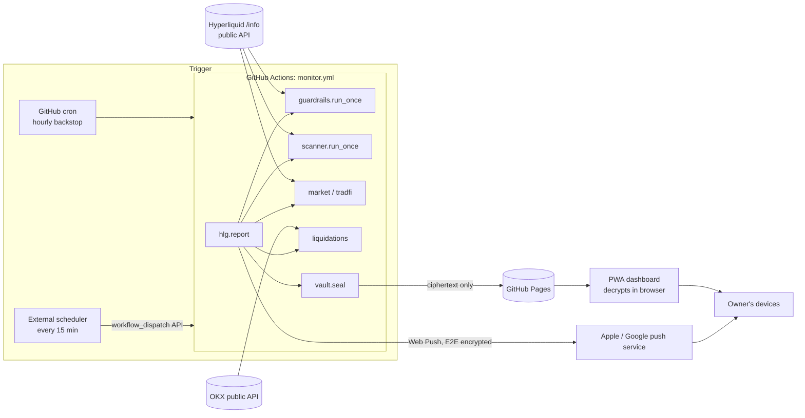

# Architecture

hl-guardrails watches one Hyperliquid account and one list of coins, and tells its owner two
things: when the account breaks a risk rule, and when a tested setup appears. It is **advisory
only**. It reads public data, never holds a key, and never places, modifies or cancels an order.

This document covers how the system is put together. For the security model see
[security.md](security.md); for running it, [operations.md](operations.md).

## At a glance



One run takes about 15 seconds: fetch, evaluate, encrypt, publish, push. Nothing runs between runs
and there is no server or database. State lives in the published, encrypted `state.json` and is
read back at the start of the next run.

## Components

| Module | Role | Network |
|---|---|---|
| `hlg/common.py` | config loading (+ local overlay, env account), logging with public-log redaction, `Notifier` (alert collection and cooldown), `State` | – |
| `hlg/account.py` | the account model: detects unified vs classic, picks the equity base, computes HL's account ratio and leverage, and nets spot into perp exposure | HL |
| `hlg/guardrails.py` | the risk rules: stops, sizing, leverage, exposure, hold time, averaging down, daily and weekly loss locks | HL |
| `hlg/scanner.py` | the breakout setup on 1d and 4h, the momentum heads-up, funding carry, and the asset-context fetch (`ctx_map`) | HL |
| `hlg/universe.py` | which coins are scanned: `scanner.coins`, or the top N perps by 30-day median volume, rebuilt once per UTC day | – |
| `hlg/liqmap.py` | liquidation clusters per coin from the public positions of ~560 large and active HL accounts; refreshed every 4h after the push | HL, HL leaderboard |
| `hlg/journal.py` | live signal journal: each breakout signal followed under the strategy's rules, result in R | – |
| `hlg/alerts.py` | alert lifecycle: first seen, valid until, live/missed/failed/expired, what gets pushed | – |
| `hlg/market.py` | pure transforms: volume, OI, premium and spread rows; the TradFi liquidity filter | – |
| `hlg/liquidations.py` | recent liquidation events from OKX, time-boxed and fail-soft | OKX |
| `hlg/events.py` | scheduled high-impact releases: weekly calendar + FOMC schedule, pushed 24h heads-up, breakout-alert note | FairEconomy, federalreserve.gov |
| `hlg/sentiment.py` | Crypto Fear & Greed: live reading for the dashboard, daily history for the backtest | alternative.me |
| `hlg/digest.py` | daily brief: public RSS headlines digested by a model into a tilt and cited points (`OPENROUTER_API_KEY` or `ANTHROPIC_API_KEY`) | RSS feeds, OpenRouter / Anthropic API |
| `hlg/macro.py` | FRED macro series for research and backtests (off in CI, see below) | FRED |
| `hlg/vault.py` | AES-256-GCM encryption of everything published | – |
| `hlg/report.py` | the one-shot CI entry point that ties the modules together | via the modules above |
| `hlg/vapid.py` | one-off VAPID key generator for Web Push | – |
| `hlg/backtest.py`, `hlg/regime.py`, `hlg/miner.py`, `hlg/stablecoin.py` | research tools, run locally; not part of the monitor | HL, FRED, DefiLlama |
| `scripts/weekly_universe_study.py` | reruns `hlg.backtest --universe-study` weekly (`.github/workflows/universe-study.yml`) and appends the result to `docs/research/`; never edits `config.yaml` | HL |
| `pwa/` | static dashboard: `index.html` (UI, decryption, tabs), `sw.js` (offline shell, push display), manifest, icons | Pages, OKX (fallback) |

`guardrails` and `scanner` also run as long-lived local processes (`python -m hlg.guardrails`,
`run.sh`, the systemd units in `deploy/`), sending to the console or Telegram instead of Pages.

## A monitor run, step by step

`python -m hlg.report`, from `.github/workflows/monitor.yml`:

1. **Load config.** `config.yaml` is overlaid with `config.local.yaml` if present. The account comes
   from `HLG_ACCOUNT`, whitespace-stripped, and `require_account` stops the run if it isn't a
   42-character `0x` address.
2. **Read the previous run.** Fetch `state.json`, `alerts.json` and `history.json` from Pages.
   Reuse the salt of any envelope found, so the key stays the same across runs, then decrypt.
   Plaintext (from before encryption) and the locked stub are handled too; see `load_prev`.
3. **Guardrails.** Evaluate every rule against live positions, open orders and the account model.
   Day and week baselines and the loss lock persist in `state`. Just before this, the event
   calendar is refreshed if stale (`hlg/events.py`, every 6h), so the scanner can see it.
4. **Scanner.** Resolve today's coin list (`hlg/universe.py`), then breakout signals per timeframe from
   cached bar statistics and one `allMids` price snapshot, momentum from stored snapshots, and
   funding notes.
5. **Context.** One extra asset-context call gives market and TradFi rows. Liquidations are
   fetched with a hard budget. Fear & Greed is refreshed every 6h. Releases within 24h become
   `event` heads-up alerts (pushed once per release time).
6. **Lifecycle** (`hlg/alerts.py`). An alert is *new* if its key wasn't live in the previous
   `alerts.json`; `first_seen` carries over by key. Signals that stopped being live move to `ended`
   as missed (ran more than 1 ATR past the signal close), failed (back below the breakout level)
   or expired, and are kept for 24 hours.
7. **Publish.** Write `alerts.json`, `history.json`, then `state.json` last, each sealed by the
   vault. With no passphrase in CI, the locked stub is written instead.
8. **Push.** Web Push the new alerts flagged `push` (guardrail breaches, breakout entries, momentum;
   not funding notes or breakouts on coins already held) to every subscription, plus a test message if the manual
   `test_push` input was set. Push is skipped when the previous state couldn't be read, since every
   alert would look new.
9. **After the push**, the slow context: liquidation levels every 4h, then once a UTC day the
   daily brief (`hlg/digest.py`: RSS fetch plus one model call, ~1 min). Each republishes if it
   produced something, so neither can delay a notification.
10. The workflow then copies `pwa/` into `site/`, stamps `config.js` with the public VAPID key, and
   deploys Pages.

## Published data

Every file on Pages is an envelope:

```json
{"v": 1, "alg": "AES-256-GCM", "kdf": "PBKDF2-SHA256", "iter": 600000,
 "salt": "<b64 16B>", "iv": "<b64 12B>", "ct": "<b64 ciphertext+tag>"}
```

or, when encryption isn't configured in CI, `{"locked": "..."}`.

Decrypted `alerts.json`, the dashboard payload:

| key | content |
|---|---|
| `generated` | ISO timestamp (UTC) |
| `account` | the watched address |
| `equity` | the sizing base: USDC collateral (unified) or perp account value (classic) |
| `acct` | the account model: mode, base, base label, ratio, leverage, maintenance margin, notional, spot holdings |
| `day_pnl`, `week_pnl`, `day_start_equity`, `week_start_equity`, `locked_until` | loss-limit tracking |
| `positions` | coin, size, entry, value, uPnL, liquidation price, leverage, margin type |
| `alerts` | `{kind, cat: position/entry/heads_up/info, key, text, summary, push, new, first_seen, valid_until?, status, meta?}`; ordered by category |
| `ended` | signals that left the live list in the last 24h, with `status` missed/failed/expired, `why` and `ended_at` |
| `universe` | `{mode, coins, day}`: how the scanned list was chosen |
| `liqmap` | `{t, accounts, positions, coins: {coin: {px, coverage, clusters, near}}}`: liquidation clusters, distances against the current price |
| `scan` | scanner rows, each tagged with its timeframe `tf`, plus `vlm24h`, `urank` (auto universe) and `near_atr` (within 0.5 ATR of its trigger) |
| `market`, `tradfi` | volume, OI, 24h change, premium and spread rows; `tradfi.dropped` counts hidden dead listings |
| `liquidations` | `{src: "baked", rows}` or null (the dashboard then fetches OKX itself, labelled `live`) |
| `macro` | FRED backdrop, or null |
| `events` | `{upcoming: [{t, country, titles, forecast, previous}], next_fomc, fetched}`: the next 7 days of high-impact releases |
| `fng` | `{value, label, as_of, series}`: Fear & Greed, 90 days |
| `digest` | `{day, t, model, headline, tilt, confidence, why, points: [{text, links}], watch, n_items, sources, failed}`, or null |
| `rules` | the rule thresholds in force |

The encrypted `state.json` also carries the scanner's working memory between runs: `universe` (today's
list), `scan_cache` (per coin and timeframe bar statistics, reused until that bar closes) and
`mid_snaps` (all-mids snapshots for the momentum check) `journal` (followed signals), and `liqmap` / `liqmap_accounts` (the latest clusters and the day's account list). A 15-minute run therefore fetches candles
only for bars that have closed since the last run.

`history.json` is a list, capped at 2000 entries, of `{t, equity, n_alerts, new}`.

## Data sources

| Source | Used for | Notes |
|---|---|---|
| Hyperliquid `/info` | positions, orders, spot, portfolio PnL series, candles, asset contexts, `userAbstraction` | public, no key; ~5000-candle cap per interval |
| Hyperliquid `xyz` dex | TradFi perps (indices, metals, energy, FX, equities) | many listings are dead; liquidity-filtered |
| Hyperliquid leaderboard | the account list for the liquidation map | ~40 MB, fetched once a day |
| OKX public API | recent liquidation events, BTC/ETH/SOL | HL publishes no liquidation data; CORS-open, so the browser can fall back |
| FRED | macro series for research | unreachable from Actions runners, so `macro_context: false` |
| FairEconomy weekly calendar | high-impact releases, current week only | unofficial Forex Factory feed; rate-limits hard (429), fetched 6-hourly |
| federalreserve.gov | FOMC meeting schedule, years ahead | HTML page, parsed; a parse returning < 6 meetings keeps the old list |
| alternative.me | Crypto Fear & Greed | daily, back to 2018 |
| RSS feeds (11) | headlines for the daily brief | list in `hlg/digest.py`; each fail-soft, 30s total budget |
| OpenRouter or Anthropic API | the daily brief | one call a day; public data only; Claude Opus 5.5 first via OpenRouter, with fallbacks |

## Design decisions

The reasoning behind the non-obvious choices, kept here so they aren't undone by accident.

| Decision | Why |
|---|---|
| Advisory only; no keys | The losses this was built to prevent came from human behaviour, not execution speed. Without keys, a compromise of the repo, CI or dashboard cannot move funds. |
| Serverless: Actions + Pages | Free, nothing to patch, no server to secure. The costs: no server-side auth (solved with encryption) and no reliable short cron (solved with an external trigger). |
| External scheduler, not GitHub cron | Measured: a `*/15` cron gave a median gap of 235 minutes. The dashboard shows staleness instead of trusting the cadence. |
| Encrypt instead of a login | Pages is static, so a login page would be decoration. Ciphertext is safe to serve publicly. |
| Allowlist log redaction | Actions logs are public on a public repo. Only errors and lines marked safe print, so a new log line can't leak by default. |
| Unified-account equity base = USDC | On a unified account, perp `accountValue` was about 1/13 of the real collateral, so risk was sized 13× too small. The formulas reproduce HL's own Unified Account Summary. |
| Breakout, not pullback | Backtested PF 1.67 vs 0.85 over 2023–2026; see README "Backtest". |
| Macro and flow are context only | Every macro filter tested worse than, or no better than, dropping the same trades at random. |
| Fail closed everywhere | A missing secret hides data instead of publishing it; a failed source degrades to null rather than failing the run. |

## Tests and CI

`pytest -q` runs 225 tests in about 2 seconds. An autouse fixture blocks all network access, so
every test uses fakes (`tests/conftest.py::FakeInfo`). Coverage includes every guardrail rule,
the account model (unified and classic), scanner setups, market transforms, the vault (tamper,
wrong key, cross-file substitution, fresh IV), fail-closed publishing, log redaction and config
encodings. `.github/workflows/test.yml` runs the suite on every push and PR.

Separately, `tests/e2e` drives `pwa/index.html` in real Chromium via Playwright (51 tests, ~25s):
decryption against a real `hlg.vault`-sealed envelope, the alert list's interactions and
persistence, every SVG chart, three viewport widths, both colour schemes, and a check that nothing
throws in the console across a full session. Excluded from the default `pytest -q` (see
`pytest.ini`); `.github/workflows/e2e.yml` runs it on demand or when a PR touches `pwa/`. README
"Development" has the setup and what it caught.
